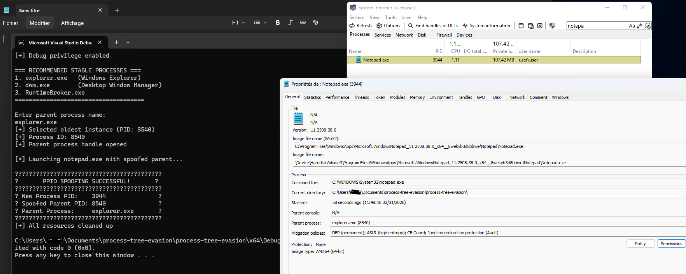
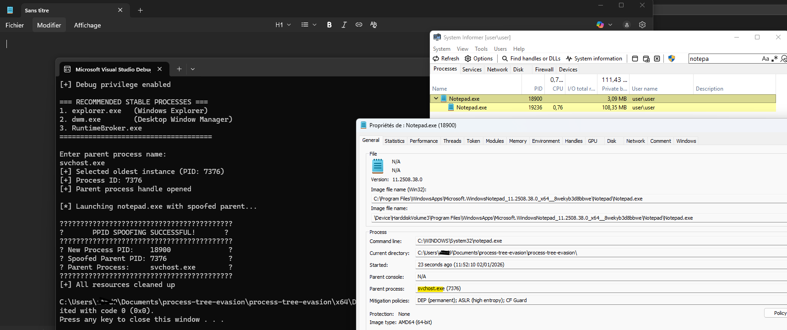

# Process tree evasion


Native C++ implementation of the **Parent PID Spoofing** technique. It allows the execution of an arbitrary payload (e.g., `notepad.exe`, shells, beacons) while making it appear as a child of a legitimate system process (like `explorer.exe` or `svchost.exe`).

This technique is widely used to evade **EDR** (Endpoint Detection and Response) and **SOC** analysis that relies on parent-child process tree anomalies.

---

## 📸 Proof of Concept

The core idea is to break the visual chain of execution.

| **Standard Execution (Suspicious)** | **Spoofed Execution (Stealthy)** |
|:-----------------------------------:|:--------------------------------:|
| `MaliciousTool.exe` 🚩              | `explorer.exe` (Parent) ✅       |
| └── `cmd.exe` (Child)               | └── `cmd.exe` (Child)            |
| *Easily flagged by EDR*             | *Looks like user activity*       |


---

## 📋 Overview

This tool allows you to launch `notepad.exe` with a spoofed parent process ID, making it appear as if it was spawned by a different process than the actual parent. This technique is commonly used in security research, red team operations, and penetration testing to evade detection systems that monitor process parent-child relationships.


Spoofing explorer.exe


Spoofing svchost.exe

## ⚠️ Disclaimer

**FOR EDUCATIONAL AND AUTHORIZED TESTING PURPOSES ONLY**

This tool is intended for:
- Security research and education
- Authorized penetration testing
- Understanding Windows process internals
- Defensive security training

Use only on systems you own or have explicit permission to test. The author is not responsible for any misuse of this tool.

## 🚀 Features

- **PPID Spoofing**: Create processes with arbitrary parent IDs
- **Privilege Escalation**: Requires and enables `SeDebugPrivilege`
- **Clean Implementation**: Proper memory management and cleanup
- **Error Handling**: Comprehensive error checking and reporting
- **Process Recommendations**: Suggests stable processes for spoofing
- **Cross-architecture**: Works on both 32-bit and 64-bit Windows

## 📁 Project Structure

```
process-tree-evasion/
├── main.cpp          # Main application logic
├── proc.h            # Header file for process utilities
├── proc.cpp          # Process utility implementations
├── README.md         # This documentation
```

## 🔧 Requirements

- **Windows 10/11** or **Windows Server 2016+**
- **Visual Studio 2019+** or **MinGW-w64**
- **Administrator privileges** (for `SeDebugPrivilege`)
- **C++17** compatible compiler

## 🛠️ Building

### Visual Studio
1. Open Visual Studio
2. Create new C++ Console Application
3. Add `main.cpp` and `proc.cpp` to the project
4. Add `proc.h` to Header Files
5. Build in **Release** mode

## 🎯 Usage

1. **Run as Administrator**: Right-click and select "Run as administrator"
2. **Enter Process Name**: Type the name of the process you want to spoof as parent
3. **Watch Notepad Launch**: The tool will launch notepad.exe with the spoofed parent

### Example Usage
```
[+] Debug privilege enabled

=== RECOMMENDED STABLE PROCESSES ===
1. explorer.exe   (Windows Explorer)
2. dwm.exe        (Desktop Window Manager)
3. RuntimeBroker.exe
=====================================

Enter parent process name: explorer.exe
[+] Process ID: 1234
[+] Parent process handle opened

[*] Launching notepad.exe with spoofed parent...

??????????????????????????????????????????
?       PPID SPOOFING SUCCESSFUL!       ?
??????????????????????????????????????????
? New Process PID:    5678               ?
? Spoofed Parent PID: 1234               ?
? Parent Process:     explorer.exe        ?
??????????????????????????????????????????

[+] All resources cleaned up
```

## Recommended Processes for Spoofing

The tool suggests these stable Windows processes:
- **explorer.exe**: Windows Explorer (most common)
- **dwm.exe**: Desktop Window Manager (stable, always running)
- **RuntimeBroker.exe**: UWP app broker process

### How PPID Spoofing Works

1. **Enable Debug Privilege**: Acquire `SeDebugPrivilege` to open handles to other processes
2. **Find Target Process**: Locate the PID of the process to spoof as parent
3. **Open Process Handle**: Obtain a handle to the target process
4. **Create Attribute List**: Initialize process thread attribute list
5. **Set Parent Attribute**: Use `UpdateProcThreadAttribute()` to set parent process
6. **Create Process**: Launch new process with `EXTENDED_STARTUPINFO_PRESENT` flag
7. **Cleanup**: Properly release all handles and memory

### Key API Functions Used

- `EnableDebugPrivilege()`: Custom function to enable debugging privileges
- `GetProcId()`: Find process ID by name
- `InitializeProcThreadAttributeList()`: Initialize process attribute list
- `UpdateProcThreadAttribute()`: Set parent process attribute
- `CreateProcessA()`: Create new process with extended startup info

## Dependencies

- **Windows API**: `windows.h`, `processthreadsapi.h`, `securitybaseapi.h`
- **Standard Library**: `iostream`, `string`

## formance Considerations

- **Memory**: Uses heap allocation for attribute lists
- **Handles**: Properly closes all handles to avoid leaks
- **Error Recovery**: Graceful failure on permission errors

## Known Issues & Limitations

1. **Administrator Required**: Must run with elevated privileges
2. **64-bit Compatibility**: May need adjustments for Wow64 processes
3. **Process Termination**: If spoofed parent exits, child remains orphaned
4. **Anti-Virus Detection**: May trigger security software alerts

## Security Considerations

- **Detection**: Modern EDR/AV solutions can detect PPID spoofing
- **Forensics**: Leaves traces in process creation events
- **Defense**: Monitor for processes with suspicious parent relationships

This project is licensed for educational purposes.
